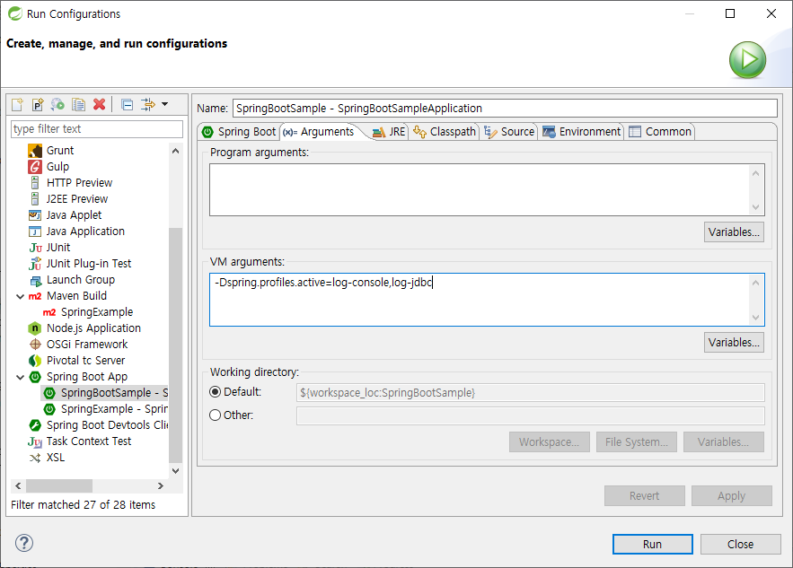

# SpringBootSample
Spring Boot Sample project for https://4urdev.tistory.com


## Create and access authority

#### Create Log folder
```
# sudo mkdir /log
```
#### access authority
```
# sudo chown {account_id} /log
```


## Database Configuration

#### Contents

```
spring.datasource.url={url}
spring.datasource.username={id}
spring.datasource.password={password}
```

#### Windows
```
c:/dev/config.properties
```
#### Linux
```
~/env/config.properties
```


## Run Spring boot with spring profile

#### Available Profiles
profile | Description
--------|-------------
log-file-windows | Write log files in c:/dev/log/spring
log-file-linux | Write log files in /log/spring
log-jdbc | Show(Write) jdbc logs
log-console | Show logs in console(std-out)

#### Run Script
```
java -jar -Dspring.profiles.active=log-file-linux,log-jdbc ./SpringExample.jar
```

#### How to run in STS (Run Configuration)

<p align="center">
  
</p> 

